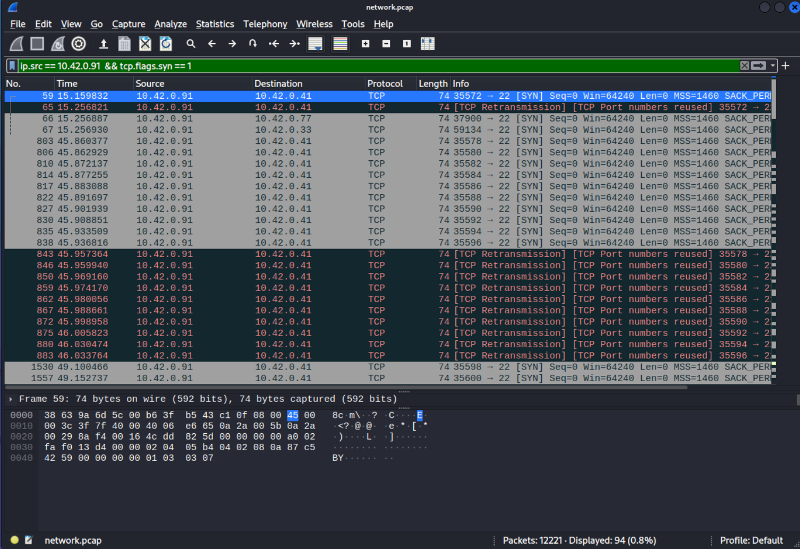
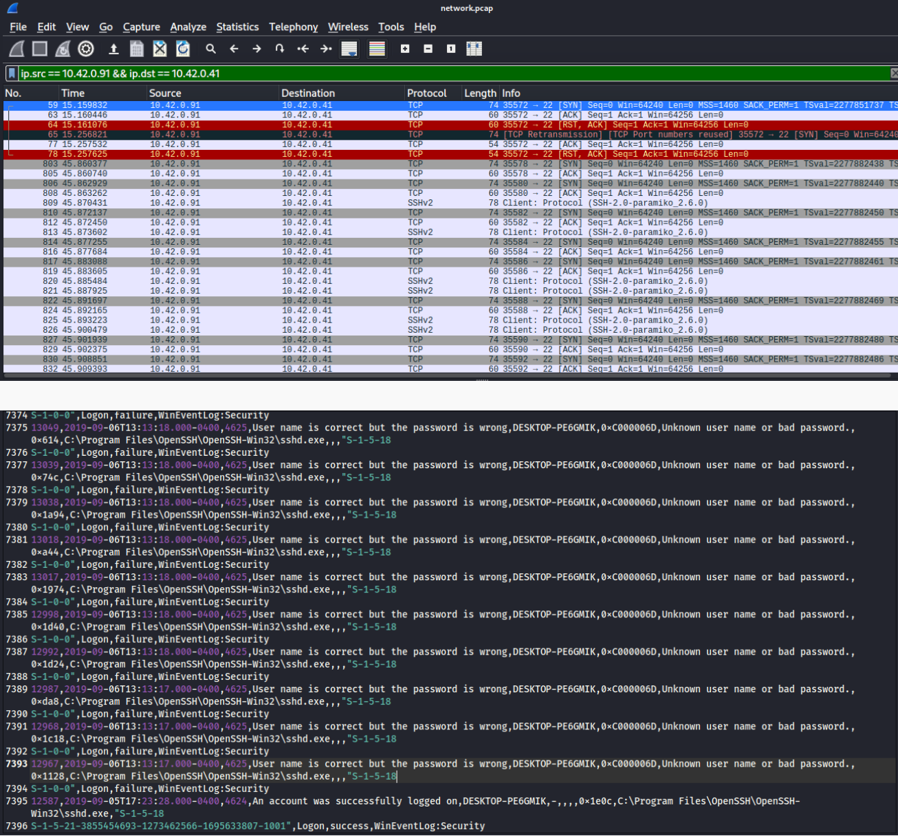
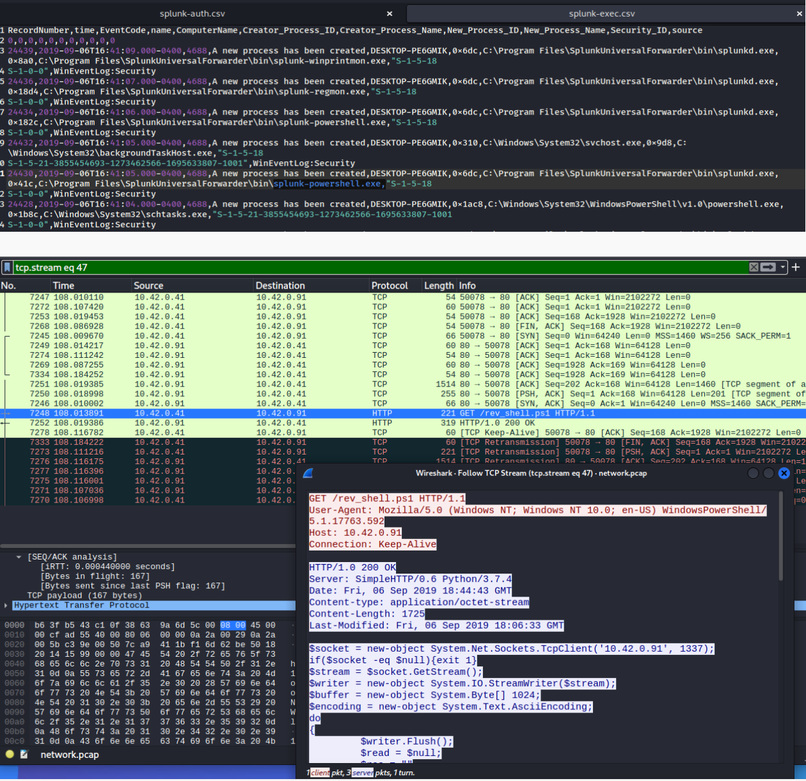

# Blue-Team-Incident-Analysis
Investigated a simulated cyber attack using Wireshark and Splunk to identify attacker behavior and persistence techniques.

Attack Analysis:

## Attack Analysis

### 1. Reconnaissance – SYN Scan Detection

**Description:**
This screenshot shows a series of TCP SYN packets originating from `10.42.0.91` targeting `10.42.0.41`.

**Analysis:**
- The attacker performed a SYN scan to identify open ports on the victim machine  
- Repeated SYN packets without completing the TCP handshake indicate reconnaissance activity  
- Targeted port suggests interest in SSH service (port 22)  

**Conclusion:**
This behavior is consistent with **network reconnaissance**, typically performed before launching an attack.

---

### 2. Attack Activity – SYN Flood / Unauthorized Access Attempts

**Description:**
This screenshot highlights abnormal traffic patterns and repeated connection attempts between attacker and victim systems.

**Analysis:**
- High volume of SYN packets indicates a potential SYN flood attack  
- Splunk logs show multiple failed authentication attempts  
- Suggests brute-force or unauthorized SSH access attempts  

**Conclusion:**
The attacker transitioned from reconnaissance to **active exploitation**, attempting to gain access to the target system.

---

### 3. Persistence – Reverse Shell Activity

**Description:**
This screenshot shows evidence of attacker persistence mechanisms after gaining access to the system.

**Analysis:**
- Execution of `schtasks.exe` indicates scheduled task creation  
- Reverse shell activity observed in network traffic  
- Persistent connection maintained between attacker and victim  

**Conclusion:**
The attacker successfully established **persistence**, allowing continued control over the compromised machine.

---

## Response & Mitigation

- Isolate the compromised host from the network  
- Implement firewall rules to block excessive SYN traffic  
- Monitor authentication logs for repeated failed login attempts  

---

## Skills Demonstrated

- Network traffic analysis (Wireshark)  
- Threat detection and attack identification  
- Log correlation (Splunk + packet data)  
- Incident response and mitigation strategy
